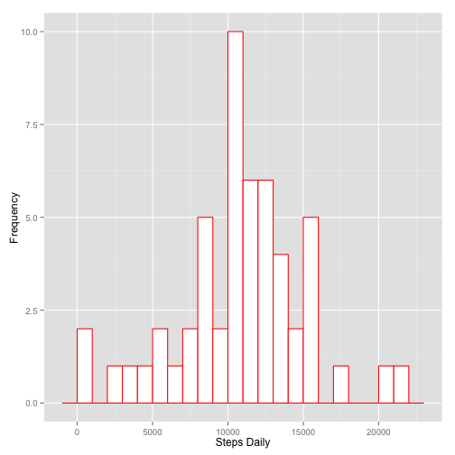
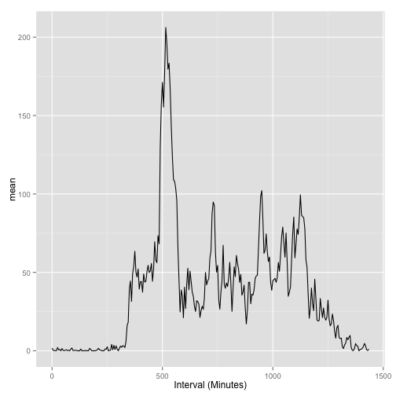
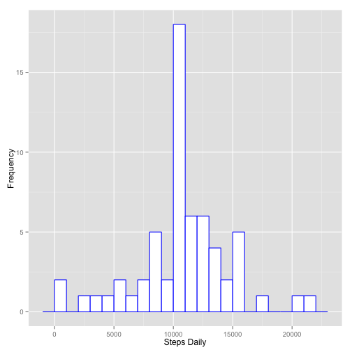
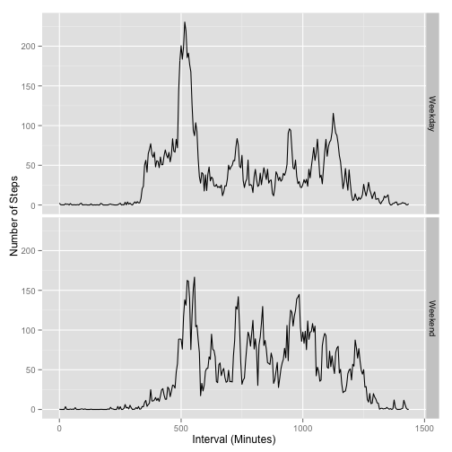

## Loading and preprocessing the data

```r
setwd("~/Documents/My Study/Coursera/Reproducable Research/Attempt2/RepData_PeerAssessment1")
# Unzip file
activityzip <- "activity.zip"
unzip(activityzip)
# Load csv file
activity <- read.csv("activity.csv")
# Look at csv file
str(activity)
```

```
## 'data.frame':	17568 obs. of  3 variables:
##  $ steps   : int  NA NA NA NA NA NA NA NA NA NA ...
##  $ date    : Factor w/ 61 levels "2012-10-01","2012-10-02",..: 1 1 1 1 1 1 1 1 1 1 ...
##  $ interval: int  0 5 10 15 20 25 30 35 40 45 ...
```

```r
# Change the date variable to a datetime rather than a factor. 
activity$date <- as.Date(as.character(activity$date))
#Change the interval variable to reflect the number of minutes since midnight.
hours <- trunc(activity$interval/100)
mins <- 100 * (activity$interval/100 - hours)
activity$interval <- hours*60 + mins
```


## What is mean total number of steps taken per day?

```r
library(dplyr)
```

```
## 
## Attaching package: 'dplyr'
## 
## The following objects are masked from 'package:stats':
## 
##     filter, lag
## 
## The following objects are masked from 'package:base':
## 
##     intersect, setdiff, setequal, union
```

```r
library(ggplot2)

# Remove rows with missing values
activityNARM <- activity[complete.cases(activity),]

## Use group_by to create a data frame containing the total number of steps for 
## each day. 
DateGroups<- group_by(activityNARM, date)
TotalSteps <- summarise(DateGroups, sum = sum(steps))

# Create a histogram of the steps data.
ggplot(data = TotalSteps, aes(x=sum))+
  geom_histogram(binwidth = 1000, color = "red", fill = "white")+
  xlab("Steps Daily")+
  ylab("Frequency")
```

 

```r
# Find the mean and median number of steps per day.
MeanSteps <- mean(TotalSteps$sum)
paste("The mean number of steps per day is approximately", round(MeanSteps, 2), sep =" ")
```

```
## [1] "The mean number of steps per day is approximately 10766.19"
```

```r
MedianSteps <- median(TotalSteps$sum)
paste("The median number of steps per day is", MedianSteps, sep =" ")
```

```
## [1] "The median number of steps per day is 10765"
```


## What is the average daily activity pattern?

```r
## Use group_by to create a data frame containing the mean number of steps for 
## each interval.
IntervalGroups <- group_by(activityNARM, interval)
MPI <- summarise(IntervalGroups,
          mean = mean(steps, na.rm = T))

## Create a time series graph of this information. 

ggplot(MPI, aes(x = interval, y = mean)) +
    geom_line()+
    xlab("Interval (Minutes)")
```

 

```r
## Find the time interval that corresponds to the highest mean. 
time <- subset(MPI, mean == max(mean))[1,1]
paste("The time interval corresponding to the highest mean is", time, "minutes since midnight or", trunc(time/60),":",time-trunc(time/60)*60, "am", sep =" ")
```

```
## [1] "The time interval corresponding to the highest mean is 515 minutes since midnight or 8 : 35 am"
```


## Imputing missing values


```r
## Calculate and report the total number of missing values in the dataset.
nas <- subset(activity, is.na(steps))
missing <- length(nas$steps)
paste("There are", missing, "missing values in the data set", sep =" ")
```

```
## [1] "There are 2304 missing values in the data set"
```

```r
## I will fill in the missing values with the mean for that interval. 

ActivityIm<- merge(activity, MPI)
for (i in 1:length(ActivityIm$steps)) {
  if (is.na(ActivityIm$steps[i])) {
    ActivityIm$steps[i] <- ActivityIm$mean[i]
    }
}

## Use group_by to create a data frame containing the total number of steps for 
## each day. 
DateGroupsIm<- group_by(ActivityIm, date)
TotalStepsIm <- summarise(DateGroupsIm, sum = sum(steps))

# Create a histogram of the steps data.
ggplot(data = TotalStepsIm, aes(x=sum))+
  geom_histogram(binwidth = 1000, color = "blue", fill = "white")+
  xlab("Steps Daily")+
  ylab("Frequency")
```

 

As a reminder, here's our histogram from before


```r
ggplot(data = TotalSteps, aes(x=sum))+
  geom_histogram(binwidth = 1000, color = "red", fill = "white")+
  xlab("Steps Daily")+
  ylab("Frequency")
```

 

You can see the distrubution is somewhat different. The peak between 10000 steps and 11000 steps per day is much more pronounced for the imputed data. 

# Find the mean and median number of steps per day.

```r
MeanStepsIm <- mean(TotalStepsIm$sum)
paste("The mean number of steps per day is approximately", 
      round(MeanStepsIm, 2), sep =" ")
```

```
## [1] "The mean number of steps per day is approximately 10766.19"
```

```r
MedianStepsIm <- median(TotalStepsIm$sum)
paste("The median number of steps per day is approximately", 
      round(MedianStepsIm, 2), sep =" ")
```

```
## [1] "The median number of steps per day is approximately 10766.19"
```

The previous values were a mean of about 10766.19 steps and a median of 10765 steps. The imputation does not change the mean, and only lowers the median by about one step per day (unimportant in the grand scheme of things.)


## Are there differences in activity patterns between weekdays and weekends?

```r
ActivityIm$weekday <- weekdays(ActivityIm$date)
ActivityIm$weekend <-rep("Weekday",length(ActivityIm$weekday))

for (i in 1:length(ActivityIm$weekday)) {
  if (ActivityIm$weekday[i] == "Sunday" | 
            ActivityIm$weekday[i] == "Saturday") {
    ActivityIm$weekend[i] <- "Weekend"
    }
}

ActivityIm$weekend <- as.factor(ActivityIm$weekend)

ggplot(aes(x = interval, y = steps ), data = ActivityIm) +
  geom_line(stat = 'summary', fun.y = mean) +
  facet_grid(weekend ~ .)+
  xlab("Interval (Minutes)")+
  ylab("Number of Steps")
```

 

So, yes, there are some differences in the activity patterns on the weekend. Most noticibly, the spike at around 8:35 am is not very pronounced in the weekend data. People seem to be less active in the early morning on the weekend too, with more activity in the middle of the day. 
